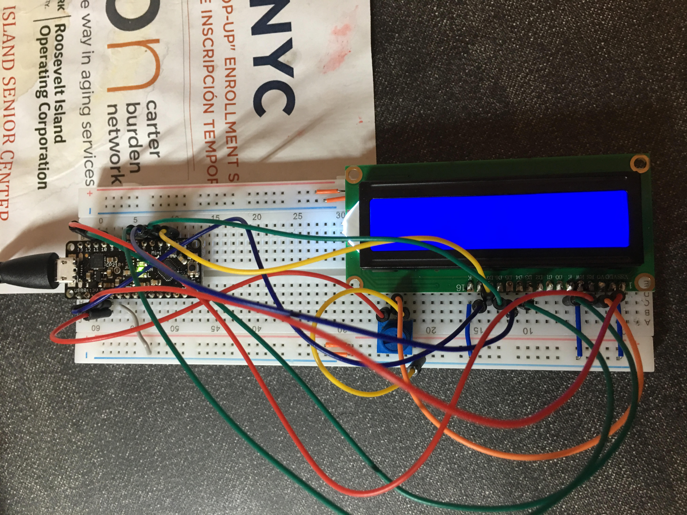

# A Digital Timer!

## Part A. Solder your LCD panel

## Part B. Writing to the LCD
 
**a. What voltage level do you need to power your display?**

I need 5V to power the display

**b. What voltage level do you need to power the display backlight?**

I also need 5V for the backlight
   
**c. What was one mistake you made when wiring up the display? How did you fix it?**

I tried to connect the GND to the ground and instead connected the pin next to it to the ground. I fixed simply by noticing something's doesn't seem right and changing it. 

**d. What line of code do you need to change to make it flash your name instead of "Hello World"?**

I changed lcd.print("Hello, World!"); to - lcd.print("Tal Genkin");
 
**e. Include a copy of your Lowly Multimeter code in your lab write-up.**

## Part C. Using a time-based digital sensor

**Upload a video of your working rotary encoder here.**

## Part D. Make your Arduino sing!

**a. How would you change the code to make the song play twice as fast?**
 
**b. What song is playing?**

## Part E. Make your own timer

**a. Make a short video showing how your timer works, and what happens when time is up!**

**b. Post a link to the completed lab report your class hub GitHub repo.**
